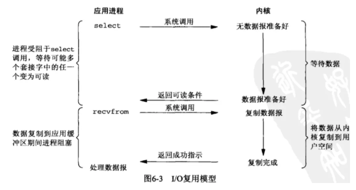

# 基本概念
- **流**
  流的概念，一个流可以是文件，socket，pipe等等可以进行I/O操作的内核对象。
- **I/O的操作**
  通过read，我们可以从流中读入数据；通过write，我们可以往流写入数据。socket还有一个accept，会用来接受写的socket链接。
  缓冲区，以及内核缓冲区的引入是为了减少频繁I/O操作而引起频繁的系统调用（你知道它很慢的），当你操作一个流时，更多的是以缓冲区为单位进行操作，这是相对于用户空间而言。对于内核来说，也需要缓冲区。

  

  以下的四个情形涵盖了四个I/O事件，读缓冲区，写阻塞，写缓冲区，读阻塞.
  1. 当内核缓冲区为空的时候，进程B会阻塞住 **读阻塞**
  2. 当进程A往内核缓冲区写入时，内核缓冲区就不是空状态了，这时候就会唤醒进程B **读缓冲区**
  3. 如果缓冲区满了，但是进程B没有被唤醒，就会通知进程A，告诉A不要再写入数据了，也就是进程A被阻塞 **写阻塞**
  4. 当进程B被唤醒后，B就从缓冲区读取数据，由于B在读数据，缓冲区就不会是满的状态了，这时候就会通知A继续写数据，也就是进程A被唤醒 **写缓冲区**
- **操作系统写操作**
  一次写操作分为两步：将数据从用户空间拷贝到系统空间；从系统空间往硬件设备（网卡，硬盘）写。

- **操作系统读操作**
  一次读操作分为两步：将数据从网卡拷贝到系统空间；将数据从系统空间拷贝到用户空间。

**问题点: 现在假定一个情形，我们需要从流中读数据，但是流中还没有数据，（典型的例子为，客户端要从socket读如数据，但是服务器还没有把数据传回来），这时候该怎么办？**

# Unix下五种I/O模型
- **同步阻塞 I/O**
  
  最传统的一种IO模型，即在读写数据过程中会发生阻塞现象。当用户线程发出IO请求之后，内核会去查看数据是否就绪，如果没有就绪就会等待数据就绪，而用户线程就会处于阻塞状态，用户线程交出CPU。当数据就绪之后，内核会将数据拷贝到用户线程，并返回结果给用户线程，用户线程才解绑block状态。典型的阻塞IO模型的例子为：data = socket.read()；如果数据没有就绪，就会一直阻塞在read方法。当数据就绪之后，内核会自动唤醒该线程。

**优点： 概念清楚，编程简单**
**缺点： 进程会阻塞在accept，read，write系统调用处，程序不能执行其他任何操作。(系统调用使得程序从用户态陷入内核态。)**
**问题点： 在阻塞I/O情况下，一个线程只能处理一个流的I/O事件。也就是说，如果想处理多个流的I/O事件（大并发），就必须使用多进程(fork)，或者多线程，但是线程的创建调度，比较消耗资源时间**
**适应场景： 适合IO流的数量比较少（千级别），但IO流的长度比较大的情况**

- **同步非阻塞 I/O**
  
  当用户线程发起一个read操作后，并不需要等待，而是马上就得到了一个结果。如果结果是一个Error时，它就知道数据还没准备好，于是它可以再次发送read操作。一旦内核中的数据准备好了，并且又再次受到了用户线程的请求，那么它马上就将数据拷贝到了用户线程，然后返回。所以事实上，在非阻塞IO模型中，用户线程需要循环不断地询问内核数据是否就绪，也就是说非阻塞IO模型不会交出CPU，而会一直占用CPU。
**优点：不会被阻塞，轮询的方法：依次询问每个流，如果缓冲区不为空，就进行操作；否则，询问下一个流**
**缺点：这种方法效率很低，会白白浪费掉CPU资源**
**问题点：因为会白白浪费掉CPU资源，很少单独使用非阻塞 I/O，一般会多路复用**

- **I/O 多路复用（select和poll，epoll）**
  
  了为了避免CPU空转，引进了一个代理这个代理可以同时观察许多流的I/O事件，在空闲的时候，会把当前线程阻塞掉，当有一个或多个流有I/O事件时，就从阻塞态中醒来，于是我们的程序就会轮询一遍所有的流。
  多路复用IO模型是目前使用比较多的模型。在多路复用IO模型中，会有一个线程不断去轮询多个流的状态，只有当流真正有读写事件时，才真正调用实际的IO读写操作。因为在多路复用IO模型中，只需要使用一个线程就可以管理多个流，系统不需要建立新的线程或者进程，也不必维护这些线程和进程，并且只有在真正有流读写事件进行时，才会使用IO资源，所以它大大减少了资源占用。多路复用IO模式，通过一个线程就可以管理多个流，只有在真正有流读写事件进行时，才会使用IO资源进行实际的读写操作。因此，多路复用IO比较适合连接数比较多的情况。另外多路复用IO为何比非阻塞IO模型的效率高是因为在非阻塞IO中，不断地询问流状态时通过用户线程去进行的，而在多路复用IO中，轮询每个流状态是内核进行的，这个效率比用户线程要高的多。
  **select** 代理，单个进程能够监视的文件描述符的数量存在最大限制，通常是1024
  **poll**代理，使用链表保存文件描述符，因此没有了监视文件数量的限制。
  **epoll**（event poll）代理，每当FD就绪，系统注册的回调函数会被调用。
  **优点：**
    结合了阻塞和非阻塞IO的优点
  **缺点：**
    1. 内核/用户空间内存拷贝问题，select需要复制大量的句柄数据结构，产生巨大的开销；
    2. select返回的是含有整个流的数组，应用程序需要遍历整个流数组才能发现哪些流发生了事件；（不能精确到具体的流有了I/O事件）
    3. select的触发方式是水平触发，应用程序如果没有完成对一个已经就绪的文件描述符进行IO操作，那么之后每次select调用还是会将这些文件描述符通知进程。
    4.  epoll解决了上述1，2，3，缺点。

  **问题点：**
    在JDK1.5 update10和Linux core2.6以上版本，Sun优化了Selctor的实现，它在底层使用epoll替换了select/poll，上层的API并没有变化，可以认为是JDK NIO的一次性能优化。
    适用于大并发，共吞吐量的情况。

  **适应场景：**
   适合IO流的数量大（万级别），但IO流的长度比较小的情况（如聊天）

- **信号驱动 I/O（SIGIO）**
  应用进程使用 sigaction 系统调用，内核立即返回，应用进程可以继续执行，也就是说等待数据阶段应用进程是非阻塞的。内核在数据到达时向应用进程发送 SIGIO 信号，应用进程收到之后在信号处理程序中调用 recvfrom 将数据从内核复制到应用进程中。信号驱动 I/O 的 CPU 利用率很高。java好像没有实现信号驱动 I/O。
  

- **异步 I/O（Posix.1的aio_系列函数）**
  应用进程执行 aio_read 系统调用会立即返回，应用进程可以继续执行，不会被阻塞，内核会在所有操作完成之后向应用进程发送信号。
  异步 I/O 与信号驱动 I/O 的区别在于，异步 I/O 的信号是通知应用进程 I/O 完成，而信号驱动 I/O 的信号是通知应用进程可以开始 I/O。
  

# Java中四种I/O模型
## 1. BIO即是阻塞I/O
  Java的IO包主要关注的是从原始数据源的读取以及输出原始数据到目标媒介。以下是最典型的数据源和目标媒介：

  - 文件
  - 管道
  - 网络连接
  - 内存缓存
  - System.in, System.out, System.error(注：Java标准输入、输出、错误输出)
  -
  虽然java IO类库庞大，但总体来说其框架还是很清楚的。从是读媒介还是写媒介的维度看，Java IO可以分为：
  1. 输入流：InputStream和Reader
  2. 输出流：OutputStream和Writer

  而从其处理流的类型的维度上看，Java IO又可以分为：
  1. 字节流：InputStream和OutputStream
  2. 字符流：Reader和Writer

## 2. 通过NIO实现的Reactor模式即是I/O复用模型的实现
  Java NIO非堵塞技术实际是采取反应器模式，或者说是观察者(observer)模式为我们监察I/O端口，如果有内容进来，会自动通知我们。
  NIO 有一个主要的类Selector，这个类似一个观察者，只要我们把需要探知的SocketChannel告诉Selector，我们接着做别的事情，当有事件发生时，他会通知我们，传回一组SelectionKey，我们读取这些Key，就会获得我们刚刚注册过的SocketChannel，然后，我们从这个Channel中读取数据，接着我们可以处理这些数据。

  反应器模式与观察者模式在某些方面极为相似：当一个主体发生改变时，所有依属体都得到通知。不过，观察者模式与单个事件源关联，而反应器模式则与多个事件源关联 。
  

## 3. 通过AIO实现的Proactor模式即是异步I/O模型
  java aio在windows上是利用iocp实现的，这是真正的异步IO。而在linux上，是通过epoll模拟异步的
  Java的AIO API其实就是Proactor模式的应用。

也Reactor模式类似，Proactor模式也可以抽象出三类角色：

a）Acceptor。用户处理客户端连接请求。Acceptor角色映射到Java代码中，即为AsynchronousServerSocketChannel。

b）Proactor。用于分派IO完成事件的处理任务。Proactor角色映射到Java代码中，即为API方法中添加回调参数。

c）Handler。用于处理具体的IO完成事件。（比如处理读取到的数据等）。Handler角色映射到Java代码中，即为AsynchronousChannelGroup 中的每个线程。

可见，Proactor与Reactor最大的区别在于：

a）无需使用多路复用器。

b）Handler无需执行具体的IO操作（比如读取数据或写入数据），而是只执行IO数据的业务处理。
## 对于NIO和传统IO区别
以前的流总是堵塞的，一个线程只要对它进行操作，其它操作就会被堵塞，也就相当于水管没有阀门，你伸手接水的时候，不管水到了没有，你就都只能耗在接水（流）上。

nio的Channel的加入，相当于增加了水龙头（有阀门），虽然一个时刻也只能接一个水管的水，但依赖轮换策略，在水量不大的时候，各个水管里流出来的水，都可以得到妥善接纳，这个关键之处就是增加了一个接水工，也就是Selector，他负责协调，也就是看哪根水管有水了的话，在当前水管的水接到一定程度的时候，就切换一下：临时关上当前水龙头，试着打开另一个水龙头（看看有没有水）。

当其他人需要用水的时候，不是直接去接水，而是事前提了一个水桶给接水工，这个水桶就是Buffer。也就是，其他人虽然也可能要等，但不会在现场等，而是回家等，可以做其它事去，水接满了，接水工会通知他们。

# NIO和IO适用场景
NIO是为弥补传统IO的不足而诞生的，但是尺有所短寸有所长，NIO也有缺点，因为NIO是面向缓冲区的操作，每一次的数据处理都是对缓冲区进行的，那么就会有一个问题，在数据处理之前必须要判断缓冲区的数据是否完整或者已经读取完毕，如果没有，假设数据只读取了一部分，那么对不完整的数据处理没有任何意义。所以每次数据处理之前都要检测缓冲区数据。
1. 如果需要管理同时打开的成千上万个连接，这些连接每次只是发送少量的数据，例如聊天服务器，这时候用NIO处理数据可能是个很好的选择。
2. 而如果只有少量的连接，而这些连接每次要发送大量的数据，这时候传统的IO更合适。使用哪种处理数据，需要在数据的响应等待时间和检查缓冲区数据的时间上作比较来权衡选择。

$\color{#00FFFF}{红色字}$
