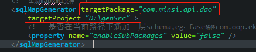
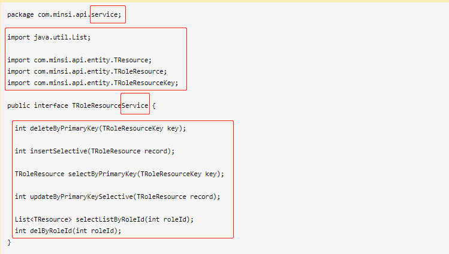
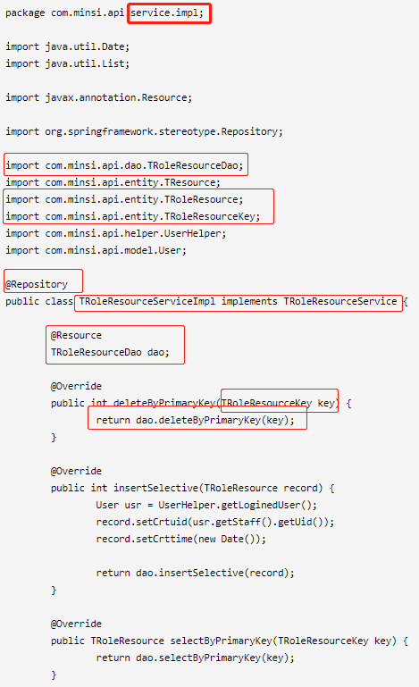
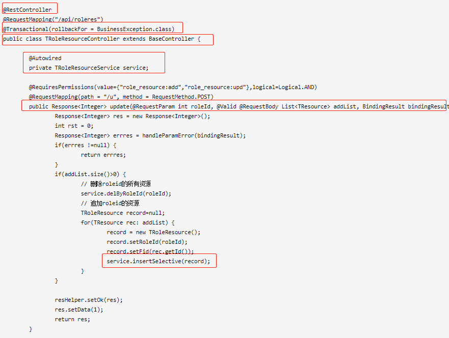

# 思路
1. mybatis generator可以生成dao（interface），mapper.xml,entity
2. 利用javaparser (https://github.com/javaparser/javaparser)
   解析生成的dao-interface，生成service，controller。
3. 生成 service interface文件
    
    **修改步骤**
    3.1 从mybatis generator配置文件取得文件生成路径和dao的包名。
    3.2 修改包名 xx.xx.dao --> xx.xx.service
    3.3 copy import
    3.4 修改类名 TRoleResourceDao --> TRoleResourceService
    3.5 copy method
    
4. 生成 service impl文件
    **修改步骤**
    4.1 修改包名 xx.xx.dao --> xx.xx.serviceImpl
    4.2 copy import
    4.3 追加下记import
      - import javax.annotation.Resource;
      - import org.springframework.stereotype.Service;
      - import xx.xx.dao.TRoleResourceDao
    4.4 在类名前追加注解 Service
    4.5 追加类名 public class TRoleResourceServiceImpl implements TRoleResourceService
    4.6 追加 field TRoleResourceDao dao;
    4.7 循环取出方法名，和参数，追加方法实现， dao.方法名(参数)

  

5. 生成 controller文件
  **修改步骤**
  5.1 修改包名 xx.xx.dao --> xx.xx.controller
  5.2 copy import
  5.3 追加下记 import
    - import javax.annotation.Resource;
    - import org.springframework.web.bind.annotation.RestController;
    - import com.minsi.api.service.TRoleResourceService;

    5.4 在类名前追加注解 RestController，@Transactional，@RequestMapping
    5.5 追加类名
    5.6 追加 field TRoleResourceService service;
    5.7 循环取出方法名，和参数，追加方法实现， dao.方法名(参数)
      追加注解，RequestBody, BindingResult

     


3. 生成的dao文件
```
package com.minsi.api.dao;

import com.minsi.api.entity.TRoleResource;
import com.minsi.api.entity.TRoleResourceKey;

public interface TRoleResourceDao {
    int deleteByPrimaryKey(TRoleResourceKey key);

    int insert(TRoleResource record);

    int insertSelective(TRoleResource record);

    TRoleResource selectByPrimaryKey(TRoleResourceKey key);

    int updateByPrimaryKeySelective(TRoleResource record);

    int updateByPrimaryKey(TRoleResource record);
}
```
4. 要生成的service interface文件
```
package com.minsi.api.service;

import java.util.List;

import com.minsi.api.entity.TResource;
import com.minsi.api.entity.TRoleResource;
import com.minsi.api.entity.TRoleResourceKey;

public interface TRoleResourceService {

  int deleteByPrimaryKey(TRoleResourceKey key);

  int insertSelective(TRoleResource record);

  TRoleResource selectByPrimaryKey(TRoleResourceKey key);

  int updateByPrimaryKeySelective(TRoleResource record);

  List<TResource> selectListByRoleId(int roleId);
  int delByRoleId(int roleId);
}
```
5. 要生成的service impl文件
```
package com.minsi.api.service.impl;

import java.util.Date;
import java.util.List;

import javax.annotation.Resource;

import org.springframework.stereotype.Repository;

import com.minsi.api.dao.TRoleResourceDao;
import com.minsi.api.entity.TResource;
import com.minsi.api.entity.TRoleResource;
import com.minsi.api.entity.TRoleResourceKey;
import com.minsi.api.helper.UserHelper;
import com.minsi.api.model.User;

@Repository
public class TRoleResourceServiceImpl implements TRoleResourceService {

	@Resource
	TRoleResourceDao dao;

	@Override
	public int deleteByPrimaryKey(TRoleResourceKey key) {
		return dao.deleteByPrimaryKey(key);
	}

	@Override
	public int insertSelective(TRoleResource record) {
		User usr = UserHelper.getLoginedUser();
		record.setCrtuid(usr.getStaff().getUid());
		record.setCrttime(new Date());

		return dao.insertSelective(record);
	}

	@Override
	public TRoleResource selectByPrimaryKey(TRoleResourceKey key) {
		return dao.selectByPrimaryKey(key);
	}

	@Override
	public int updateByPrimaryKeySelective(TRoleResource record) {
		User usr = UserHelper.getLoginedUser();
		record.setUpduid(usr.getStaff().getUid());
		record.setUpdtime(new Date());
		return dao.updateByPrimaryKey(record);
	}

	@Override
	public List<TResource> selectListByRoleId(int roleId) {
		return dao.selectListByRoleId(roleId);
	}

	@Override
	public int delByRoleId(int roleId) {
		return dao.delByRoleId(roleId);
	}
}
```
6. controller文件
```
package com.minsi.api.controller;

import java.util.List;

import javax.validation.Valid;

import org.apache.shiro.authz.annotation.Logical;
import org.apache.shiro.authz.annotation.RequiresPermissions;
import org.springframework.beans.factory.annotation.Autowired;
import org.springframework.transaction.annotation.Transactional;
import org.springframework.validation.BindingResult;
import org.springframework.web.bind.annotation.RequestBody;
import org.springframework.web.bind.annotation.RequestMapping;
import org.springframework.web.bind.annotation.RequestMethod;
import org.springframework.web.bind.annotation.RequestParam;
import org.springframework.web.bind.annotation.RestController;

import com.minsi.api.entity.TResource;
import com.minsi.api.entity.TRoleResource;
import com.minsi.api.exception.BusinessException;
import com.minsi.api.model.Response;
import com.minsi.api.service.TRoleResourceService;

@RestController
@RequestMapping("/api/roleres")
@Transactional(rollbackFor = BusinessException.class)
public class TRoleResourceController extends BaseController {

	@Autowired
	private TRoleResourceService service;

	@RequiresPermissions(value={"role_resource:add","role_resource:upd"},logical=Logical.AND)
	@RequestMapping(path = "/u", method = RequestMethod.POST)
	public Response<Integer> update(@RequestParam int roleId, @Valid @RequestBody List<TResource> addList, BindingResult bindingResult) throws Exception {
		Response<Integer> res = new Response<Integer>();
		int rst = 0;
		Response<Integer> errres = handleParamError(bindingResult);
		if(errres !=null) {
			return errres;
		}
		if(addList.size()>0) {
			// 删除roleid的所有资源
			service.delByRoleId(roleId);
			// 追加roleid的资源
			TRoleResource record=null;
			for(TResource rec: addList) {
				record = new TRoleResource();
				record.setRoleId(roleId);
				record.setFid(rec.getId());
				service.insertSelective(record);
			}
		}

		resHelper.setOk(res);
		res.setData(1);
		return res;
	}

	@RequiresPermissions(value = { "role_resource:sch" })
	@RequestMapping(path = "/list", method = RequestMethod.POST)
	public Response<List<TResource>> getListByRoleId(@RequestBody int roleId) {
		List<TResource> list = service.selectListByRoleId(roleId);
		Response<List<TResource>> res = new Response<List<TResource>>();
		resHelper.setOk(res);
		res.setData(list);
		return res;
	}
}
```
