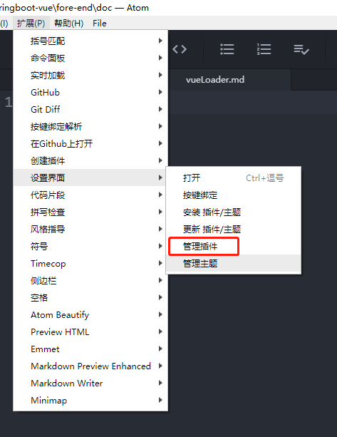
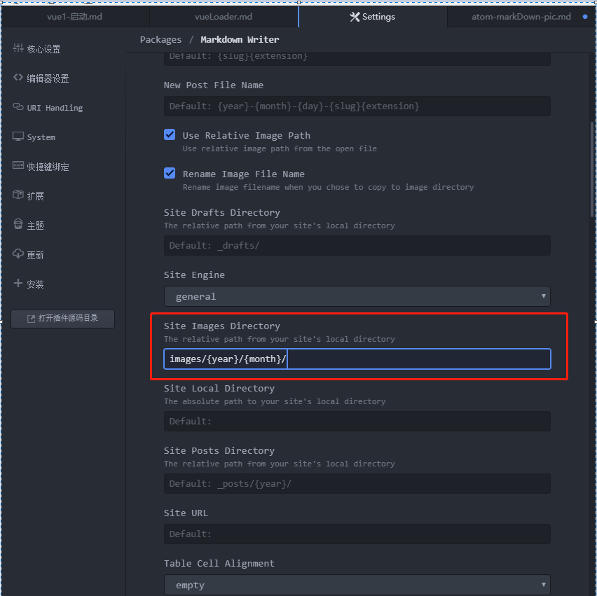
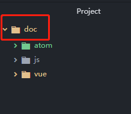
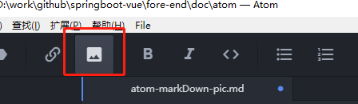

# 在atom中编辑markdown文件如何方便处理图片呢
1. 如果用github的话，就没有必要上传到图床服务器，直接保存到本地的相对目录下，然后push到github上就可以了。

2. 设置atom的markdown writer扩展件
  打开 扩展 --> 设置界面 --> 管理插件
  
  就会打开如下的界面
  
  设置 site Images direcotry
  设置的这个目录是你打开的项目文件夹的相对目录，是用来存放粘贴板内存中的图片的
  我习惯于将[images/{year}/{month}]设置为[pic/]
  例如，你打开的项目文件夹如下
  
  你点击如下的insert image button，就会将粘贴板内存中的图片保存到doc/pic/xxx.png
  

3. 使用方法
  - [win]键 + [shift]键 + [s]键 调出系统snip截图工具，将截图保存到内存粘贴板中
  - 点击atom的insert image按钮，将内存粘贴板中图片数据保存到目录pic下。
