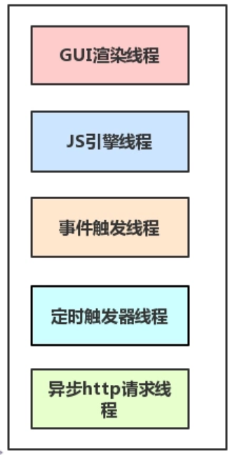
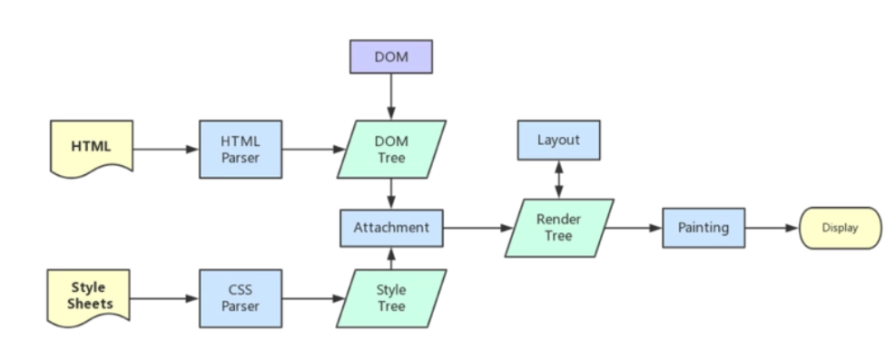

# 前言 -- 浏览器的工作渲染
要了解js的promise必须先要知道大多js是运行在浏览器的，是多进程多线程，js是单线程的

# 浏览器的核心进程
### 1. Browser进程 浏览器的主进程（负责协调、主控），只有一个
  - 负责浏览器界面显示，与用户交互。如前进，后退等
  - 负责各个页面的管理，创建和销毁其他进程
  - 网络资源的管理，下载等

### 2. 第三方插件进程：每种类型的插件对应一个进程，仅当使用该插件时才创建
### 3. GPU进程：最多一个，用于3D绘制等
### 4. 浏览器渲染进程（浏览器内核）（Renderer进程，内部是多线程的）：默认每个Tab页面一个进程，互不影响。主要作用为
  页面的渲染，JS的执行，事件的循环，都在这个进程内进行
  **最重要的是这个进程浏览器的渲染进程是多线程的**

# 浏览器渲染进程中的线程


### 1. GUI渲染线程
  - 负责渲染浏览器界面，解析HTML，CSS，构建DOM树和RenderObject树，布局和绘制等。
  - 当界面需要重绘（Repaint）或由于某种操作引发回流(reflow)时，该线程就会执行
  - 注意，**GUI渲染线程与JS引擎线程是互斥的**，当JS引擎执行时GUI线程会被挂起（相当于被冻结了），GUI更新会被保存在一个队列中等到JS引擎空闲时立即被执行。
  -
### 2. JS引擎线程
  - 也称为JS内核，负责处理Javascript脚本程序。（例如V8引擎）
  - JS引擎线程负责解析Javascript脚本，运行代码。
  - JS引擎一直等待着任务队列中任务的到来，然后加以处理，一个Tab页（renderer进程）中无论什么时候都只有一个JS线程在运行JS程序
  - 同样注意，GUI渲染线程与JS引擎线程是互斥的，所以如果JS执行的时间过长，这样就会造成页面的渲染不连贯，导致页面渲染加载阻塞。

### 3. 事件触发线程
  - 归属于浏览器而不是JS引擎，用来控制事件循环（可以理解，JS引擎自己都忙不过来，需要浏览器另开线程协助）
  - 当JS引擎执行代码块如setTimeOut时（也可来自浏览器内核的其他线程,如鼠标点击、AJAX异步请求等），会将对应任务添加到事件线程中
  - 当对应的事件符合触发条件被触发时(例如 setTimeout，ajax异步请求完成)，该线程会把事件添加到待处理队列的队尾，等待JS引擎的处理
  - 注意，由于JS的单线程关系，所以这些待处理队列中的事件都得排队等待JS引擎处理（当JS引擎空闲时才会去执行）

### 4. 定时触发器线程
  - setInterval与setTimeout所在线程
  - 浏览器定时计数器并不是由JavaScript引擎计数的,（因为JavaScript引擎是单线程的, 如果处于阻塞线程状态就会影响记计时的准确）因此通过单独线程来计时并触发定时（计时完毕后，添加到事件队列中，等待JS引擎空闲后执行）
  - 注意，W3C在HTML标准中规定，规定要求setTimeout中低于4ms的时间间隔算为4ms。

### 5. 异步http请求线程
  - 在XMLHttpRequest在连接后是通过浏览器新开一个线程请求
  - 将检测到状态变更时，如果设置有回调函数，异步线程就产生状态变更事件，将这个回调再放入事件队列中。再由JavaScript引擎执行。
# 浏览器渲染流程
- 浏览器输入url，
  浏览器主进程接管，开一个下载线程，然后进行 http请求（略去DNS查询，IP寻址等等操作），然后等待响应，获取内容，随后将内容通过RendererHost接口转交给Renderer进程
- 浏览器渲染流程开始
  浏览器器内核拿到内容后，渲染大概可以划分成以下几个步骤：
  1. 解析html建立dom树
  2. 解析css构建render树（将CSS代码解析成树形的数据结构，然后结合DOM合并成render树）
  3. 布局render树（Layout/reflow），负责各元素尺寸、位置的计算
  4. 绘制render树（paint），绘制页面像素信息
  5. 浏览器会将各层的信息发送给GPU，GPU会将各层合成（composite），显示在屏幕上。
  所有详细步骤都已经略去，渲染完毕后就是load事件了，之后就是自己的JS逻辑处理了
  

# js的同步异步
由于JavaScript是可操纵DOM的，如果在修改这些元素属性同时渲染界面（即JS线程和UI线程同时运行），那么渲染线程前后获得的元素数据就可能不一致了。因此为了防止渲染出现不可预期的结果，浏览器设置GUI渲染线程与JS引擎为互斥的关系，当JS引擎执行时GUI线程会被挂起，GUI更新则会被保存在一个队列中等到JS引擎线程空闲时立即被执行。
相反JS如果执行时间过长就会阻塞页面，假设JS引擎正在进行巨量的计算，此时就算GUI有更新，也会被保存到队列中，等待JS引擎空闲后执行。然后，由于巨量计算，所以JS引擎很可能很久很久后才能空闲，自然会感觉到巨卡无比。所以，要尽量避免JS执行时间过长，这样就会造成页面的渲染不连贯，导致页面渲染加载阻塞的感觉。

**所以我们不要将大量的计算耗时的任务放在js的主线程中，耗时的任务要异步执行，而且不能操作dom**
由于js的单线程特性，所以JavaScript的所有网络操作，浏览器事件，都必须是异步执行。

# js的Event Loop
  - JS分为同步任务和异步任务
  - 同步任务都在主线程上执行，形成一个执行栈,栈中的代码调用某些api时，它们会在事件队列中添加各种事件（当满足触发条件后，如ajax请求完毕）
  - 主线程之外，事件触发线程管理着一个任务队列，只要异步任务有了运行结果，就在任务队列之中放置一个事件。
  - 一旦执行栈中的所有同步任务执行完毕（此时JS引擎空闲），系统就会读取任务队列，取出一个异步任务添加到可执行栈中，开始执行。
  - 如此循环
  

# macrotask与microtask
```
console.log('script start');

setTimeout(function() {
    console.log('setTimeout');
}, 0);

Promise.resolve().then(function() {
    console.log('promise1');
}).then(function() {
    console.log('promise2');
});

console.log('script end');
```
它的正确执行顺序是这样子的：
script start
script end
promise1
promise2
setTimeout

### 1. macrotask（又称之为宏任务），
  可以理解是每次执行栈执行的代码就是一个宏任务（包括每次从事件队列中获取一个事件回调并放到执行栈中执行）
  - 每一个task会从头到尾将这个任务执行完毕，不会执行其它
  - 浏览器为了能够使得JS内部task与DOM任务能够有序的执行，会在一个task执行结束后，在下一个 task 执行开始前，对页面进行重新渲染
  （`task->渲染->task->渲染->...`）
### 2. microtask（又称为微任务）
可以理解是在当前 task 执行结束后立即执行的任务
- 在某一个macrotask执行完后，就会将在它执行期间产生的所有microtask都执行完毕（在渲染前）所以它的响应速 度相比setTimeout（setTimeout是task）会更快

- macrotask：主代码块，setTimeout，setInterval，requestAnimationFarme(浏览器独有）等（可以看到，事件队列中的每一个事件都是一个macrotask）
- microtask：Promise的then方法，process.nextTick，Object.observe，MutationObserver等

### 3. 从线程的角度来看
  - macrotask中的事件（setTimeOut,onLoad,onClick,ajax）都是放在一个事件队列中的，而这个队列由事件触发线程维护
  - microtask中的所有微任务(promise)都是添加到微任务队列（Job Queues）中，等待当前macrotask执行完毕后执行，而这个队列由JS引擎线程维护
  总结js运行流程
  1. 执行一个宏任务（栈中没有就从事件队列中获取）
  2. 执行过程中如果遇到微任务，就将它添加到微任务的任务队列中
  3. 宏任务执行完毕后，立即执行当前微任务队列中的所有微任务（依次执行）
  4. 当前宏任务执行完毕，开始检查渲染，然后GUI线程接管渲染
  5. 渲染完毕后，JS线程继续接管，开始下一个宏任务（从事件队列中获取）

# Javascript异步编程的4种方法
  ### 1. 回调函数
  假定有2个函数f1和f2，f2等待f1的执行结果。
  ```
  function f1() {
    console.log('执行耗时任务1')
    return '耗时任务1结果'
  }

  function f2(result) {
    console.log('执行f2，f1 结果' + result)
  }

  function onLoad() {
    var result = f1();
    f2(result);
    // 后续代码
    f3()；
    。。。
  }

  ```
  如果f1是一个很耗时的任务，可以考虑改写f1，把f2写成f1的回调函数。这样就不影响f3等后续代码的执行
  ```
  // f1是耗时function，f2是回调函数
  function f1(callback){
       // 异步执行
　　　　setTimeout(function () {
　　　　　　// f1的任务代码
          console.log('执行耗时任务1')
          var result = '耗时任务1结果'
          // 回调callback(耗时任务的结果)     
          callback(result);

　　　　}, 0);

　　}

  function onLoad() {
    // 异步执行
    f1(f2);
    // 后续代码
    f3();
    。。。
  }
  ```
  采用这种方式，我们把同步操作变成了异步操作，f1不会堵塞程序运行，相当于先执行程序的主要逻辑，将耗时的操作推迟执行。
  回调函数的优点是简单、容易理解和部署，缺点是不利于代码的阅读和维护，各个部分之间高度耦合（Coupling），流程会很混乱，而且每个任务只能指定一个回调函数。

### 2. 事件监听
另一种思路是采用事件驱动模式。任务的执行不取决于代码的顺序，而取决于某个事件是否发生。

还是以f1和f2为例。首先，为f1绑定一个事件（这里采用的jQuery的写法）。
```
function f2(result) {
  console.log('执行f2，f1 结果' + result)
}

function f1(){

　　　　setTimeout(function () {

　　　　　　// f1的任务代码
          console.log('执行耗时任务1')
          var result = '耗时任务1结果'
          // trigger 第一个参数是绑定事件类型，第二个参数是object类型，即传递的参数
          f1.trigger('done', result);

　　　　}, 1000);

}

function onLoad() {
  // 当f1发生done事件，就执行f2
  f1.on('done', f2(result));
  // 异步执行
  f1();
  // 后续代码
  f3();
  。。。
}
```
这种方法的优点是比较容易理解，可以绑定多个事件，每个事件可以指定多个回调函数，而且可以"去耦合"（Decoupling），有利于实现模块化。缺点是整个程序都要变成事件驱动型，运行流程会变得很不清晰。

### 3. 发布/订阅
又称"观察者模式"
这个模式有多种实现，下面采用的是Ben Alman的Tiny Pub/Sub，这是jQuery的一个插件。
```
function f2(result) {
  console.log('执行f2，f1 结果' + result)
}


function f1(){

　　　　setTimeout(function () {

　　　　　　// f1的任务代码
          console.log('执行耗时任务1')
          var result = '耗时任务1结果'
　　　　　　jQuery.publish("done",result);

　　　　}, 1000);

}
// 主执行代码
function onLoad() {
  // 首先，f2向"信号中心"jQuery订阅"done"信号。
  jQuery.subscribe("done", f2);
  // 异步执行
  f1();
  // 后续代码
  f3();
  。。。
}
```
此外，f2完成执行后，也可以取消订阅（unsubscribe）。
jQuery.unsubscribe("done", f2);
这种方法的性质与"事件监听"类似，但是明显优于后者。因为我们可以通过查看"消息中心"，了解存在多少信号、每个信号有多少订阅者，从而监控程序的运行。

# promise用法
Promises对象是CommonJS工作组提出的一种规范，目的是为异步编程提供统一接口。

  - 其中要特别注意的是**promise对象一旦建立就执行，只不过promise对象的then方法是异步的**
  - 当then（）没有return时则默认返回的仍是调该then方法的promise对象
  - 当then（）里有return则返回的是指定的promise对象

我们先看一个最简单的Promise例子：生成一个0-2之间的随机数，如果小于1，则等待一段时间后返回成功，否则返回失败：
```
function test(resolve, reject) {
    var timeOut = Math.random() * 2;
    log('set timeout to: ' + timeOut + ' seconds.');
    // 异步执行，也可以ajax异步请求
    setTimeout(function () {
        if (timeOut < 1) {
            log('call resolve()...');
            resolve('200 OK');
        }
        else {
            log('call reject()...');
            reject('timeout in ' + timeOut + ' seconds.');
        }
    }, timeOut * 1000);
}
```
这个test()函数有两个参数，这两个参数都是函数，如果执行成功，我们将调用resolve('200 OK')，如果执行失败，我们将调用reject('timeout in ' + timeOut + ' seconds.')。可以看出，test()函数只关心自身的逻辑，并不关心具体的resolve和reject将如何处理结果。

有了执行函数，我们就可以用一个Promise对象来执行它，并在将来某个时刻获得成功或失败的结果：
```
var p1 = new Promise(test);
var p2 = p1.then(function (result) {
    console.log('成功：' + result);
});
var p3 = p2.catch(function (reason) {
    console.log('失败：' + reason);
});
```
变量p1是一个Promise对象，它负责执行test函数。由于test函数在内部是异步执行的，当test函数执行成功时，我们告诉Promise对象：
```
// 如果成功，执行这个函数：
p1.then(function (result) {
    console.log('成功：' + result);
});
```
当test函数执行失败时，我们告诉Promise对象：
```
p2.catch(function (reason) {
    console.log('失败：' + reason);
});
```
Promise对象可以串联起来，所以上述代码可以简化为：
```
new Promise(test).then(function (result) {
    console.log('成功：' + result);
}).catch(function (reason) {
    console.log('失败：' + reason);
});
```
下面是一个用Promise对象实现的 Ajax 操作的例子。
```
const getJSON = function(url) {
  const promise = new Promise(function(resolve, reject){
    // 请求结果处理函数
    const handler = function() {
      if (this.readyState !== 4) {
        return;
      }
      if (this.status === 200) {
        resolve(this.response);
      } else {
        reject(new Error(this.statusText));
      }
    };
    const client = new XMLHttpRequest();
    client.open("GET", url);
    client.onreadystatechange = handler;
    client.responseType = "json";
    client.setRequestHeader("Accept", "application/json");
    client.send();

  });

  return promise;
};

getJSON("/posts.json").then(function(json) {
  console.log('Contents: ' + json);
}).catch(function(error) {
  console.error('出错了', error);
}).finally(function() {
  console.log('不管出错与否都执行');
}

  );
```
Promise.all()
booksPromise和userPromise是两个异步操作，只有等到它们的结果都返回了，才会触发pickTopRecommendations这个回调函数。
```
const databasePromise = connectDatabase();

const booksPromise = databasePromise
  .then(findAllBooks);

const userPromise = databasePromise
  .then(getCurrentUser);

Promise.all([
  booksPromise,
  userPromise
])
.then(([books, user]) => pickTopRecommendations(books, user));
```
# ECMAScript 2017的Async/await 
