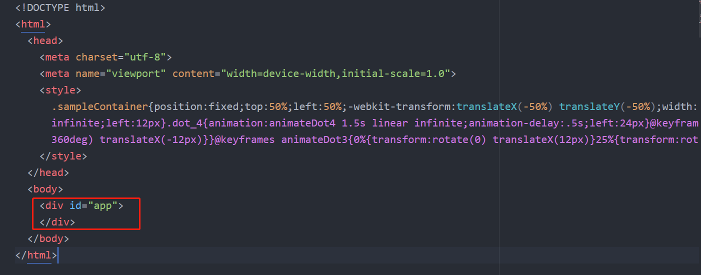

我们先看一下vue的目录结构

先说结论，实际上spa项目因为只有一个页面，我们在浏览器中输入项目路径，如果没有输入具体的页面的话，web服务器运行启动是从默认的index.html开始，然后执行main.js文件，然后main.js会将app.vue最后运算出的结果替换到html的`<div id='app'>`标签中。实际上显示那个页面是由router.js的设置决定的。

# 1. index.html
从开发环境的index.html其实并不能发现是如何运行的。

因为这个文件并没有包含任何的js文件
在执行npm run build 命令时，就会调用打包工具**webpack**来打包js，css等一系列文件,同时会添加用到的main.js，xxx.css代码到index.html的。
我们会发现在build\webpack.base.conf.js文件中有main.js文件的设置

我们看一下打包后的 index.html

在这个文件中webpack将需要的css文件，main.js文件都添加到了index.html中。

# 2. main.js


# 3. App.vue

其实app.vue基本上啥也没干也就是填了个`<router-view/>`,这个router-view是由router.js来定义的。
```
<template>
  <div id="app">
    <router-view/>
  </div>
</template>

<script>
export default {
  name: 'App',
  methods: {
  }
}
</script>
```

# 4.router
router.beforeEach() 跳转页面必进的函数（相当于应用入口函数），用来权限，是否登录判断


router.js就是设置路径和页面的配置


# 整体启动流程

例如：
浏览器中输入 http://host/projectXXX/
1. 没有输入具体页面，服务器默认会运行index.html
2. 在index.html中会运行main.js
3. main.js会运行app.vue，APP.vue引用了routerView
4. routerView会先运行router.beforeEach()函数,没有输入路径 to="/"
5. 因为没有登录，就会跳转到登录页面
6. 输入用户名，密码点击登录，让后跳转到"/"
7. 只要有路径跳转就会进入router.beforeEach()函数，因为已经登录，所以会跳转到/页面
8. 根据路径和页面的设置，就会进入生产全景页面
