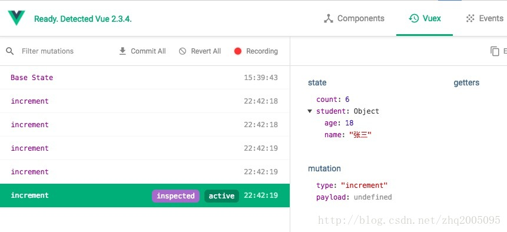

# Vuex是什么
Vuex简单说可以理解为js中的一个全局的map对象，用来存放多个页面,组件共享的对象状态变量。Vuex有一套自己的规则形成状态的组件树构成了一个巨大的“视图”，不管在树的哪个位置，任何组件都能获取状态或者触发行为！另外，通过定义和隔离状态管理中的各种概念并强制遵守一定的规则，我们的代码将会变得更结构化且易维护。
- state  存放共享状态的根节点
- Getter 用于组件或者页面读取状态属性的方法
- Mutation commit mutation用于同步改变状态的方法
- Action dispatch action用于异步改变状态的方法

# 为什么要用Vuex
- 多个组件之间共享状态
- 多个页面之间共享转态
- Vuex 的状态存储是响应式的。当 Vue 组件从 store 中读取状态的时候，若 store 中的状态发生变化，那么相应的组件也会相应地得到高效更新。
- 所有Vuex能做的，都能用其他方式实现，但是状态管理提供了统一管理的地方，操作方便，也更加明确
- 你不能直接改变 store 中的状态。改变 store 中的状态的唯一途径就是显式地提交 (commit) mutation。这样使得我们可以方便地跟踪每一个状态的变化，从而让我们能够实现一些工具帮助我们更好地了解我们的应用。


# Vuex的应用场景
- 业务组件的状态
  1. 涉及到非父子关系的组件，例如兄弟关系、祖孙关系，甚至更远的关系
  2. 假如有这样一个组件，他是弹窗，有一些复选框和输入框，用户会选择和填写信息，这个弹窗会被关闭和打开，由于业务需要，这个弹窗输入的内容，希望关闭后可以保留，在重新打开后，内容依然存在
  3. 业务上需要在多个页面之间共享状态的，例如 用户登录后，token，权限配置表，会影响很多个页面
  4. 多对多事件——多处触发，影响多处，比如：切换页面显示风格

- 复用的非业务组价，例如弹窗、表单，省市区的选择的组件，这是不应该和Vuex捆绑到一起的

# Vuex的问题
因为Vuex是在内存中单例共享管理状态，所以在浏览器关闭，刷新时，Vuex的状态会丢失。所以要将token，等重要信息存储到sessionStorage中

# 题外话
最早在前端存储信息是只能存储在cookie中有大小限制的，所以共享信息大部分是存储于服务器端，随着浏览器和SPA的发展，现在浏览器可以存储于浏览器的localStorage、sessionStorage、IndexDB中。
想象一个场景，用户在购买商品填写了很多信息，这时候需要填写地址。进入一个新的页面创建地址，然后回到原来页面要求用户填写的信息甚至打开的下拉框还在。
前一个页面的已经填写的信息状态，怎么保存保存在哪里比较好呢。如果是前端的话，可以保存在Vuex中，sessionStorage中，后端服务器中。
因为是共享转态，如果在同一个浏览器窗口中，打开两个tab页，修改开一个tab页的共享状态的话，另一个tab页的状态会实时变化吗？根据实验结果是会的。

# 使用Vuex的简单流程
现在我们引入 Vuex ，用它来管理状态数据。首先在 src 中新建一个 store.js 文件，并写下如下的代码
```
import Vue from 'vue';
import Vuex from 'vuex';

Vue.use(Vuex);

export default new Vuex.Store({
    state: {
        name: 'Lucy',
    },
    mutations: {
        setName(state, newName) {
            state.name = newName;
        }
    },
    actions: {
        modifyName({commit}, newName) {
            commit('setName', newName);
        }
    }
});
```
然后，在 main.js 中导入 store，并全局注入:
```
import store from './store';
// ...
new Vue({
    store,
    render: h => h(App),
}).$mount('#app')
```
App.vue 中的代码如下
```
<script>
    import {mapState, mapActions} from 'vuex';
    export default {
        computed: {
            ...mapState(['name'])
        },

        methods: {
            ...mapActions(['modifyName']),

            modifyNameAction() {
                this.modifyName('bighone');
            }
        },
    }
</script>
```

# state
简单例子 store/index.js 定义state
```
import Vue from 'vue'
import Vuex from 'vuex'

Vue.use(Vuex)

const store = new Vuex.Store({
  state: {
    count: 0
  }
})
```
在 Vue 组件中展示状态，从 store 实例中读取状态最简单的方法就是在计算属性中返回某个状态
```
template: `<div>{{ count }}</div>`,
  computed: {
    count () {
      return this.$store.state.count
    }
  }
```

# Getter
我们会发现 State 中的数据，并不是我们直接想要的，而是需要经过相应的处理后，才能满足我们的需求。比如在一个组件中，我们需要把 state 中的日期 date 转换成星期几来展示

```
computed: {
  weekDate () {
    return moment(this.$store.state.date).format('dddd');
  }
}
```
这里的 **moment** 是一个第三方日期处理类库，使用之前需要导入。
如果像上面这样处理的话，我们需要在每一个引用的vue文件中处理。
所以就要用的vuex的Getter

```
const store = new Vuex.Store({
  state: {
    date: new Date()
  },
  getters: {
    // Getter 接受 state 作为其第一个参数
    weekDate: state => {
      return moment(state.date).format('dddd');
    },
    // Getter 还也可以接收 getters 作为第二个参数
    dateLength: (state, getters) => {
      return getters.weekDate.length;
    }
  }
})
```
在需要引用的地方
```
computed: {
  weekDate () {
    return this.$store.getters.weekDate
  }
}
```
现在需求又变了，每个模块要显示的 weekDate 的格式不一样，有的显示全部日期，有的需要显示星期几，怎么办？
好办，那就给 Getter 传参呗，但是怎么传呢？
因为 Getter 在通过属性访问时是作为 Vue 的响应式系统的一部分缓存其中的，所以是不能直接 store.getters.weekDate('MM Do YY')，因为 weekDate 并不是一个函数，它仅仅只是一个属性而已。
那么既然属性不能传参，怎么办呢？那我们就想办法把这个属性变成一个函数不就行了。
```
getters: {
  // 返回一个函数，就可以传参了
  weekDate: (state) => (fm) => {
    return moment(state.date).format(fm ? fm : 'dddd');
  }
}
```
这里用到了箭头函数 相当于
weekDate: function(state) {
  reutrn function(fm) {
    moment(state.date).format(fm ? fm : 'dddd');
  }
}

使用如下
```
computed: {
  weekDate () {
    return this.$store.getters.weekDate
  }
}
```

# mutation
更改 Vuex 的 store 中的状态的唯一方法是提交 mutation。
mutation只能同步更改store 中的状态。
```
const store = new Vuex.Store({
  state: {
    count: 1
  },
  mutations: {
    // 事件类型 type 为 increment
    increment (state) {
      // 变更状态
      state.count++
    }
  }
})
```
使用的地方
```
this.$store.commit('increment')
```
更改状态，传递参数, n这个参数也可以是Object
```
mutations: {
  // 事件类型 type 为 increment
  increment (state, n) {
    // 变更状态
    state.count += n
  }
}
```
使用的地方
```
this.$store.commit('increment', 10)
```
**添加属性**
```
我们给 student 添加一个年龄 age: 18 属性
const store = new Vuex.Store({
  state: {
    student: {
      name: '小明',
      sex: '女'
    }
  }，
  mutations: {
  addAge (state) {
    Vue.set(state.student, 'age', 18)
    // 或者：
    // state.student = { ...state.student, age: 18 }
  }
}
})
```
**更常用的方法 使用常量**
store.commit('increment')，可以发现，这里 commit 提交的方法 increment，是以字符串的形式代入的，因为字符串容易出错，所以应使用常量来替代 mutation 事件的名字。
```
// mutation-types.js
export const SOME_MUTATION = 'SOME_MUTATION'
```
```
// store.js
import Vuex from 'vuex'
import { SOME_MUTATION } from './mutation-types'

const store = new Vuex.Store({
  state: { ... },
  mutations: {
    // 使用 ES2015 风格的计算属性命名功能来使用一个常量作为函数名
    [SOME_MUTATION] (state) {
      // mutate state
    }
  }
})
```
# Action
Action 类似于 mutation，不同在于：
1、Action 提交的是 mutation，而不是直接变更状态。
2、Action 可以包含任意异步操作。
```
const store = new Vuex.Store({
  state: {
    count: 0
  },
  mutations: {
    increment (state) {
      state.count++
    }
  },
  actions: {
    increment (context) {
      context.commit('increment')
    }
  }
})
```
Action 函数接受一个 context 参数，注意，这个参数可不一般，它与 store 实例有着相同的方法和属性，但是他们并不是同一个实例。

ES2015 的 参数解构
```
actions: {
  increment ({ commit }) {
    commit('increment')
  }
}
```
分发 Action
```
store.dispatch('increment')
```
```
actions: {
  // 登录
  Login({ commit }, userInfo) {
    const username = userInfo.username
    const password = decrypt(userInfo.password)
    const code = userInfo.code
    const uuid = userInfo.uuid
    const rememberMe = userInfo.rememberMe
    return new Promise((resolve, reject) => {
      // 异步调用后端api
      login(username, password, code, uuid).then(res => {
        console.log(JSON.stringify(res))
        var tokenStr = res.c_token
        setToken(tokenStr, rememberMe)
        commit('SET_TOKEN', tokenStr)
        commit('SET_LOAD_MENUS', true)
        resolve()
      }).catch(error => {
        reject(error)
      })
    })
},
```
使用的地方
```
this.$store.dispatch('Login', user).then(() => {
  this.loading = false
  this.$router.push({ path: this.redirect || '/' })
}).catch(() => {
  this.loading = false
  this.getCode()
})
```
# mapState
mapXXX的为辅助函数，为了更容易使用
```
// 在单独构建的版本中辅助函数为 Vuex.mapState
import { mapState } from 'vuex'

export default {
  // ...
  computed: mapState({
    // 箭头函数可使代码更简练
    a: state => state.a,
    b: state => state.b,
    c: state => state.c,

    // 传字符串参数 'b'
    // 等同于 `state => state.b`
    bAlias: 'b',

    // 为了能够使用 `this` 获取局部状态
    // 必须使用常规函数
    cInfo (state) {
      return state.c + this.info
    }
  })
}
```
如果所映射的计算属性名称与 state 的子节点名称相同时，我们还可以更加简化，给 mapState 传一个字符串数组：
```
computed: mapState([
  // 映射 this.a 为 store.state.a
  'a',
  'b',
  'c'
])
```
因为 computed 这个计算属性接收的是一个对象，所以由上面的示例代码可以看出，mapState 函数返回的是一个对象，现在如果想要和局部的计算属性混合使用的话，可以使用 ES6 的语法这样写来大大简化：
```
computed: {
  ...mapState({
    sidebar: state => state.app.sidebar,
    device: state => state.app.device,
    needTagsView: state => state.settings.tagsView,
    fixedHeader: state => state.settings.fixedHeader
  }),
}
```
使用的时候，直接
```
this.sidebar
```
# mapGetters
```
computed: {
  ...mapGetters([
    'permission_routers',
    'sidebar'
  ])
},
```
# mapMutations
```
import { mapMutations } from 'vuex'

export default {
  // ...
  methods: {
    ...mapMutations([
      // 将 `this.increment()` 映射为
      // `this.$store.commit('increment')`
      'increment',
      // `mapMutations` 也支持载荷：
      // 将 `this.incrementBy(amount)` 映射为
      // `this.$store.commit('incrementBy', amount)`
      'incrementBy'
    ]),
    ...mapMutations({
      // 将 `this.add()` 映射为
      // `this.$store.commit('increment')`
      add: 'increment'
    })
  }
}
```

# mapActions
```
import { mapActions } from 'vuex'

export default {
  // ...
  methods: {
    ...mapActions([
      // 将 `this.increment()` 映射为
      // `this.$store. dispatch('increment')`
      'increment',
      // `mapActions` 也支持载荷：
      // 将 `this.incrementBy(amount)` 映射为
      // `this.$store. dispatch('incrementBy', amount)`
      'incrementBy'
    ]),
    ...mapActions({
      // 将 `this.add()` 映射为
      // `this.$store. dispatch('increment')`
      add: 'increment'
    })
  }
}
```

# Module
Vuex 允许我们将 store 分割成大大小小的对象，每个对象也都拥有自己的 state、getter、mutation、action，这个对象我们把它叫做 module（模块），在模块中还可以继续嵌套子模块、子子模块 ……

现在在 src 里面建个文件夹，命名为 modules，然后再里面新建一个 moduleA.js 文件，并编写如下代码：
```
export default {
    state: {
        text: 'moduleA'
    },
    getters: {},
    mutations: {},
    actions: {}
}
```
如上，再建一个 moduleB.js 文件，这里就不重复了。

然后打开 store.js 文件，导入这两个 module ：
```
import moduleA from './module/moduleA';
import moduleB from './module/moduleB';

export default new Vuex.Store({
    modules: {
        moduleA, moduleB,
    },
    // ...
}
```
这个时候，store 中已经注入了两个子模块 moduleA moduleB，我们可以在 App.vue 中通过 this.$store.state.moduleA.text 这种方式来直接访问模块中的 state 数据。如下修改：
```
// ...
computed: {
    ...mapState({
        name: state => state.moduleA.text
    }),
},
// ...
```
由此可知，模块内部的 state 是局部的，只属于模块本身所有，所以外部必须通过对应的模块名进行访问。
但是模块内部的 action、mutation 和 getter 默认可是注册在全局命名空间的，这样使得多个模块能够对同一 mutation 或 action 作出响应。
这里以 mutation 的响应为例，给 moduleA 和 moduleB 分别新增一个 mutations，如下：
```
mutations: {
    setText(state) {
        state.text = 'A'
    }
},
```
在vue文件中调用mutations setText，我们会发现模块 A 和 B 中的 text 值都改变了。

**访问根节点**
我们已经知晓，模块内部的 state 是局部的，只属于模块本身所有。那么如果我们要想在模块中访问 store 根节点的数据 state，怎么办呢？

很简单，我们可以在模块内部的 getter 和 action 中，通过 rootState 这个参数来获取。接下来，我们给 modelA.js 文件添加一点代码。

```
export default {
    // ...
    getters: {
        // 注意:rootState必须是第三个参数
        detail(state, getters, rootState) {
            return state.text + '-' + rootState.name;
        }
    },
    actions: {
        callAction({state, rootState}) {
            alert(state.text + '-' + rootState.name);
        }
    }
}
```
里需要注意的是在 getters 中，rootState 是以第三个参数暴露出来的，另外，还有第四个参数 rootGetters，用来获得根节点的 getters 信息.

**命名空间**
我们已经知道了，模块内部的 action、mutation 和 getter 默认是注册在全局命名空间的。如果我们只想让他们在当前的模块中生效，应该怎么办呢？

通过添加 namespaced: true 的方式使其成为带命名空间的模块。当模块被注册后，它的所有 getter、action 及 mutation 都会自动根据模块注册的路径调整命名。

moduleA.js，如下：

```
export default {
    namespaced: true,
    // ...
    actions: {
        callAction: {
            root: true,
            handler (namespacedContext, payload) {
                let {state, commit} = namespacedContext;
                commit('setText');
                alert(state.text);
            }
        }
    }
}
```

vue中的写法

```
computed: {
    ...mapState('some/nested/module', {
        a: state => state.a,
        b: state => state.b
    })
},
methods: {
    ...mapActions('some/nested/module', [
        'foo', // -> this.foo()
        'bar' // -> this.bar()
    ])
}
```
将模块的空间名称字符串作为第一个参数传递给上述函数，这样所有绑定都会自动将该模块作为上下文。

我们还可以通过使用 createNamespacedHelpers 创建基于某个命名空间辅助函数。它返回一个对象，对象里有新的绑定在给定命名空间值上的组件绑定辅助函数：

```
import { createNamespacedHelpers } from 'vuex'

const { mapState, mapActions } = createNamespacedHelpers('some/nested/module')

export default {
  computed: {
    // 在 `some/nested/module` 中查找
    ...mapState({
      a: state => state.a,
      b: state => state.b
    })
  },
  methods: {
    // 在 `some/nested/module` 中查找
    ...mapActions([
      'foo',
      'bar'
    ])
  }
}
```

**模块的动态注册**
在 store 创建之后，可以使用 store.registerModule 方法动态的注册模块：
```
// 注册模块 `myModule`
store.registerModule('myModule', {
  // ...
})
// 注册嵌套模块 `nested/myModule`
store.registerModule(['nested', 'myModule'], {
  // ...
})
```

之后就可以通过 store.state.myModule 和 store.state.nested.myModule 访问模块的状态。

模块动态注册功能使得其他 Vue 插件可以通过在 store 中附加新模块的方式来使用 Vuex 管理状态。例如，vuex-router-sync 插件就是通过动态注册模块将 vue-router 和 vuex 结合在一起，实现应用的路由状态管理。

你也可以使用 store.unregisterModule(moduleName) 来动态卸载模块。注意，你不能使用此方法卸载静态模块（即创建 store 时声明的模块）。

在注册一个新 module 时，你很有可能想保留过去的 state，例如从一个服务端渲染的应用保留 state。你可以通过 preserveState 选项将其归档：store.registerModule('a', module, { preserveState: true })。

**模块重用**

重用会导致模块中的数据 state 被污染，所以和 Vue 中的 data 一样，也使用一个函数来申明 state 即可。

```
const MyReusableModule = {
  state () {
    return {
      foo: 'bar'
    }
  },
  //...
}
```

# 参考文章
- Vuex教程全集 - 白话篇 https://www.jianshu.com/p/b79d1c332a20
